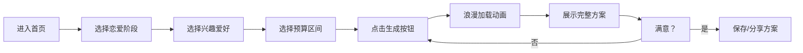

## 1. 产品概述

情侣约会方案生成器，帮助情侣快速解决"今天去哪儿玩"的决策难题。用户只需选择恋爱阶段、兴趣爱好和预算，即可一键生成包含时间安排、地点推荐、交通路线、餐饮建议和惊喜彩蛋的完整约会方案。

- 目标用户：所有年龄段的情侣，尤其是纠结约会安排的年轻情侣
- 核心价值：消除选择困难，提供个性化、有仪式感的约会体验
- 市场定位：轻量级约会规划工具，主打一键生成、惊喜感十足的使用体验

## 2. 核心功能

### 2.1 用户角色

| 角色 | 注册方式 | 核心权限 |
|------|----------|----------|
| 普通用户 | 无需注册，直接使用 | 使用方案生成器、查看历史方案、保存喜欢的方案 |

### 2.2 功能模块

1. **首页**：浪漫氛围的Hero区域、三步引导说明、方案生成表单
2. **方案展示页**：时间轴式行程安排、地点卡片、交通指引、惊喜彩蛋、重新生成按钮

### 2.3 页面详情

| 页面名称 | 模块名称 | 功能描述 |
|---------|----------|----------|
| 首页 | Hero区域 | 品牌标语、浪漫动画背景、CTA按钮 |
| 首页 | 三步引导 | 图示说明"选择偏好 → 一键生成 → 甜蜜约会"的使用流程 |
| 首页 | 方案生成表单 | 恋爱阶段选择（暧昧期/热恋期/稳定期/老夫老妻）、兴趣爱好多选（美食/电影/户外/文艺/运动/探店/手作/拍照）、预算区间选择（¥0-200/¥200-500/¥500-1000/¥1000+） |
| 方案展示页 | 加载动画 | 生成中的浪漫过渡动画 |
| 方案展示页 | 行程时间轴 | 按时间顺序展示完整约会安排，包含时间、地点、活动内容 |
| 方案展示页 | 地点卡片 | 店铺名称、评分、推荐理由、预计花费 |
| 方案展示页 | 交通指引 | 两地之间的交通方式、预计耗时 |
| 方案展示页 | 惊喜彩蛋 | 随机生成的浪漫小惊喜建议 |
| 方案展示页 | 操作区 | 保存方案、重新生成、分享按钮 |

## 3. 核心流程

用户进入首页 → 浏览产品介绍和使用说明 → 选择恋爱阶段 → 选择感兴趣的活动类型 → 选择预算区间 → 点击"生成约会方案"按钮 → 展示浪漫加载动画 → 跳转到方案展示页 → 按时间轴浏览完整行程 → 可选择重新生成或保存方案

## 4. 用户界面设计

### 4.1 设计风格

- **主色调**：柔粉色系（#FF6B9D 作为主色，#FFB6C1 作为辅助色），搭配温暖的奶白色（#FFF8F0）背景
- **点缀色**：玫瑰金（#E8C4A0）、深酒红（#8B2635）用于强调
- **按钮风格**：圆润胶囊型按钮，带微妙阴影和渐变，hover时有缩放和光泽动画
- **字体**：标题使用浪漫衬线字体「Playfair Display」，正文使用圆润无衬线「Noto Sans SC」
- **布局风格**：卡片式布局，大量留白，柔和圆角，微妙的玻璃拟态效果
- **图标风格**：使用线条柔和的emoji和lucide图标组合，如 💖🌸🍷🎬🌿

### 4.2 页面设计概述

| 页面名称 | 模块名称 | UI元素 |
|---------|----------|--------|
| 首页 | Hero区域 | 全屏渐变背景 + 漂浮心形粒子动画 + 大标题渐进式出现动画 |
| 首页 | 三步引导 | 三个等宽卡片，带数字序号，hover时上浮效果 |
| 首页 | 表单区域 | 选项卡片网格布局，选中状态有粉色边框和心跳动画 |
| 方案展示页 | 加载动画 | 旋转的爱心粒子 + "正在为你们策划浪漫..."打字机文字 |
| 方案展示页 | 时间轴 | 左侧粉色渐变时间线，右侧行程卡片，交错入场动画 |
| 方案展示页 | 地点卡片 | 图片 + 信息层叠布局，带毛玻璃效果 |
| 方案展示页 | 惊喜彩蛋 | 带丝带装饰的礼盒图标，点击展开动画 |

### 4.3 响应式

- 桌面端优先设计，最大宽度1200px居中
- 平板端：两列布局变单列，卡片间距缩小
- 移动端：单列布局，字号适配，按钮触控区域扩大到48px
- 所有交互元素支持触摸操作

### 4.4 动画与交互细节

- 页面加载：元素从下往上渐入，带轻微错位延迟
- 选项选中：心跳缩放动画（scale 1→1.1→1）
- 方案生成：加载动画持续2-3秒，增加期待感
- 时间轴卡片：依次滑入，每个卡片延迟0.15秒
- 惊喜彩蛋：点击后礼盒打开动画，内容淡入
- 鼠标悬停：按钮轻微上浮，阴影加深，背景色微变
