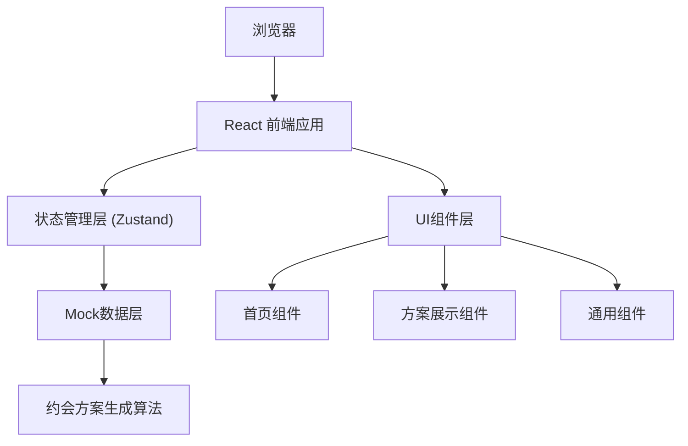

## 1. 架构设计



## 2. 技术描述

- **前端**：React@18 + TypeScript + Vite + TailwindCSS@3
- **初始化工具**：vite-init react-ts 模板
- **状态管理**：Zustand
- **图标库**：lucide-react
- **后端**：无后端，纯前端应用，使用Mock数据
- **数据持久化**：localStorage 存储历史方案
- **动画**：CSS动画 + framer-motion（用于复杂交互动画）

## 3. 路由定义

| 路由 | 页面组件 | 用途 |
|------|----------|------|
| / | HomePage | 首页，展示产品介绍和方案生成表单 |
| /plan | PlanPage | 方案展示页，展示生成的完整约会方案 |

## 4. 数据模型

### 4.1 类型定义

```typescript
// 用户选择的偏好
interface UserPreferences {
  relationshipStage: 'dating' | 'passionate' | 'stable' | 'longterm';
  interests: string[];
  budget: 'low' | 'medium' | 'high' | 'luxury';
}

// 单个活动项
interface Activity {
  id: string;
  time: string;
  type: 'dining' | 'activity' | 'transport' | 'surprise';
  name: string;
  description: string;
  location: string;
  duration: string;
  cost: number;
  image: string;
  rating?: number;
  tips?: string;
}

// 交通信息
interface TransportInfo {
  from: string;
  to: string;
  method: string;
  duration: string;
  description: string;
}

// 完整约会方案
interface DatePlan {
  id: string;
  createdAt: string;
  title: string;
  totalBudget: string;
  activities: Activity[];
  surprises: string[];
  weatherTip?: string;
}

// Mock数据库中的地点数据
interface Venue {
  id: string;
  name: string;
  type: 'restaurant' | 'cafe' | 'attraction' | 'activity' | 'cinema';
  category: string;
  address: string;
  rating: number;
  priceRange: string;
  image: string;
  description: string;
  suitableFor: string[];
  bestTime: string;
}
```

### 4.2 Mock数据结构

- venues.json: 包含餐厅、咖啡馆、景点、活动场所、电影院等地点数据
- activities.json: 各类活动模板数据
- surprises.json: 惊喜彩蛋库

## 5. 项目结构

```
/
├── src/
│   ├── components/          # 通用组件
│   │   ├── HeartParticles.tsx    # 心形粒子背景
│   │   ├── OptionCard.tsx        # 选项卡片
│   │   ├── TimelineItem.tsx      # 时间轴条目
│   │   ├── VenueCard.tsx         # 地点卡片
│   │   ├── SurpriseBox.tsx       # 惊喜彩蛋
│   │   └── LoadingAnimation.tsx  # 加载动画
│   ├── pages/               # 页面组件
│   │   ├── HomePage.tsx         # 首页
│   │   └── PlanPage.tsx         # 方案展示页
│   ├── store/               # 状态管理
│   │   └── usePlanStore.ts      # 方案状态
│   ├── utils/               # 工具函数
│   │   ├── planGenerator.ts     # 方案生成算法
│   │   └── mockData.ts          # Mock数据
│   ├── data/                # 静态数据
│   │   ├── venues.json
│   │   ├── activities.json
│   │   └── surprises.json
│   ├── types/               # 类型定义
│   │   └── index.ts
│   ├── App.tsx
│   ├── main.tsx
│   └── index.css
├── .trae/
│   └── documents/
├── package.json
├── tsconfig.json
├── vite.config.ts
└── tailwind.config.js
```

## 6. 核心算法逻辑

方案生成器 (planGenerator.ts) 核心逻辑：

1. 根据用户偏好筛选合适的地点和活动
   - 恋爱阶段影响活动的浪漫程度和亲密性
   - 兴趣爱好决定活动类型优先级
   - 预算过滤掉超出范围的选项

2. 时间规划算法
   - 默认从11:00开始，22:00结束
   - 用餐时间固定在12:00-13:30（午餐）和18:00-19:30（晚餐）
   - 活动之间预留交通时间（30-45分钟）
   - 每个活动时长根据类型自动分配（电影2小时，用餐1.5小时，逛展2小时等）

3. 路线优化
   - 根据地点位置聚类，减少往返路程
   - 优先选择同一区域的地点组合

4. 惊喜彩蛋插入
   - 根据恋爱阶段随机选择1-2个惊喜
   - 插入在活动间隙或特定时刻

5. 预算分配
   - 按比例分配到餐饮、活动、交通
   - 确保总花费在预算范围内

## 7. 性能优化

- 使用React.memo优化列表渲染
- 图片使用webp格式，设置loading="lazy"
- 动画使用CSS transforms和opacity，避免重排
- Mock数据按需加载，使用import()动态导入
