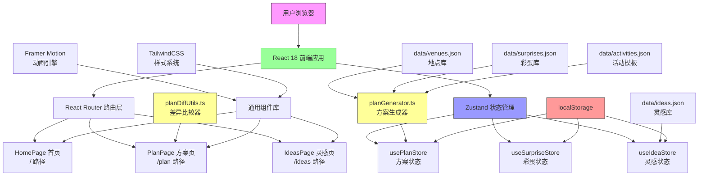
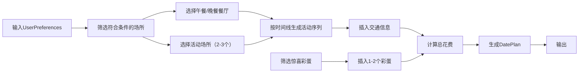
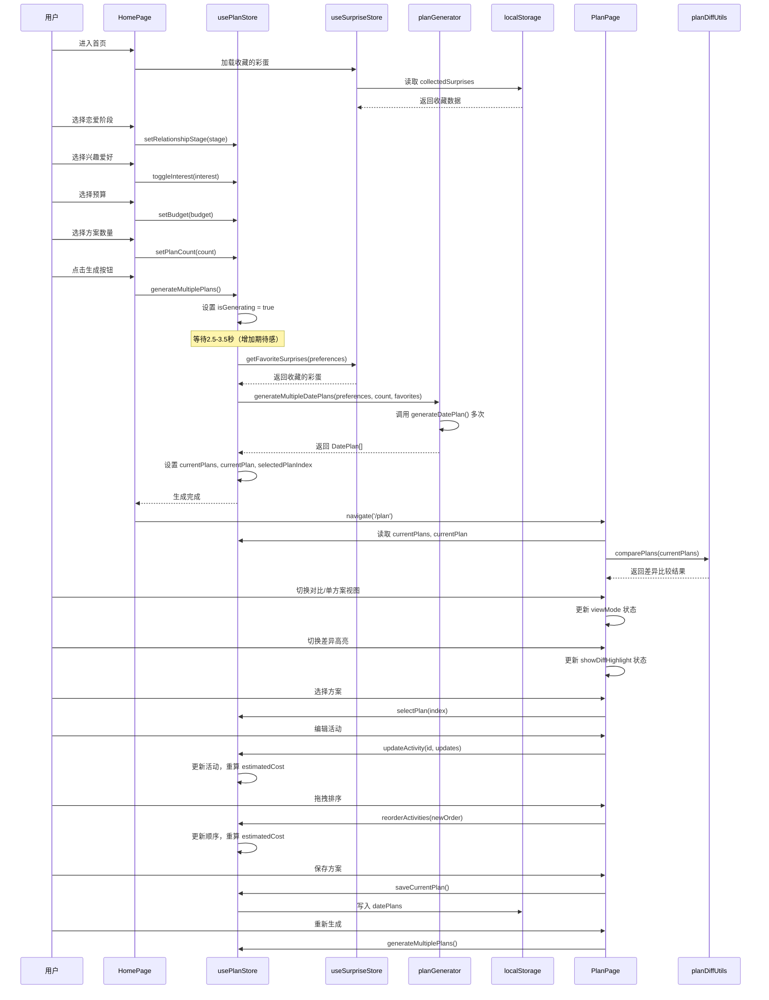
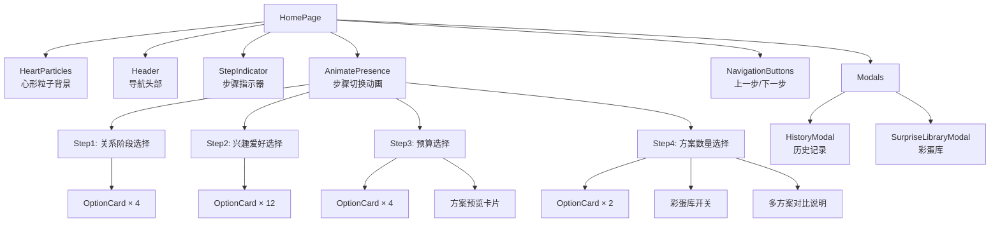
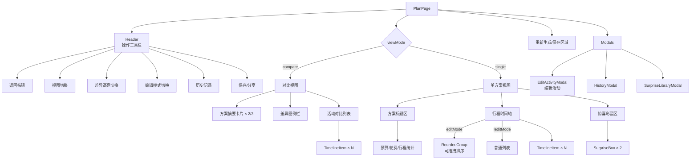
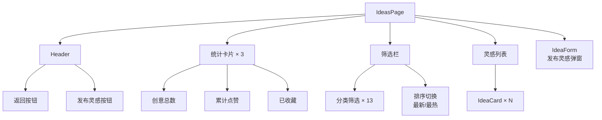
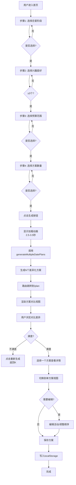
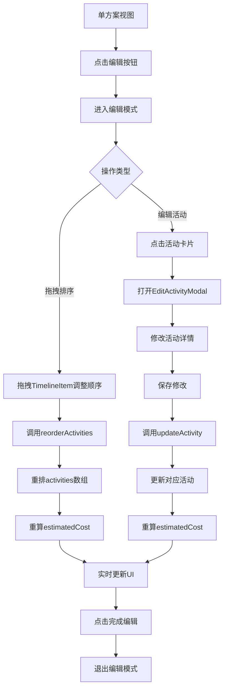
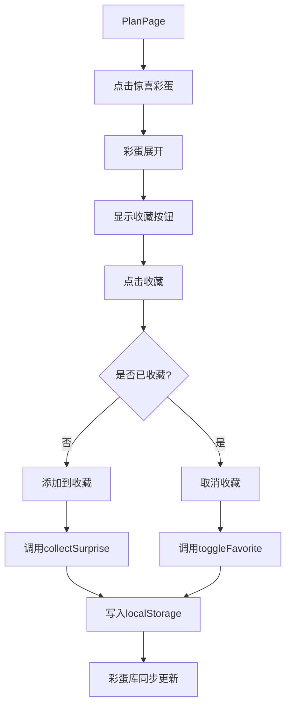

# 约会系统 - 完整架构与技术文档

## 📋 目录

1. [项目概述](#1-项目概述)
2. [系统架构图](#2-系统架构图)
3. [技术栈说明](#3-技术栈说明)
4. [核心数据结构](#4-核心数据结构)
5. [核心算法实现原理](#5-核心算法实现原理)
6. [数据流转设计](#6-数据流转设计)
7. [状态管理架构](#7-状态管理架构)
8. [页面与组件架构](#8-页面与组件架构)
9. [核心功能流程](#9-核心功能流程)
10. [数据持久化设计](#10-数据持久化设计)

---

## 1. 项目概述

### 1.1 项目定位
情侣约会方案生成器，帮助情侣快速解决"今天去哪儿玩"的决策难题。用户只需选择恋爱阶段、兴趣爱好和预算，即可一键生成包含时间安排、地点推荐、交通路线、餐饮建议和惊喜彩蛋的完整约会方案。

### 1.2 核心价值
- **消除选择困难**：智能推荐个性化方案
- **仪式感体验**：惊喜彩蛋、浪漫动画、温馨设计
- **多方案对比**：生成2-3个不同风格方案，智能高亮差异
- **灵感社区**：用户分享约会创意，互相借鉴

### 1.3 目标用户
所有年龄段的情侣，尤其针对纠结约会安排的年轻情侣。

---

## 2. 系统架构图



### 2.1 层次结构说明

| 层级 | 职责 | 关键模块 |
|------|------|----------|
| **表现层** | 用户交互与UI展示 | 页面组件、通用组件、Framer Motion动画 |
| **路由层** | 页面导航与URL管理 | React Router v7 |
| **状态层** | 全局状态管理与共享 | Zustand Stores |
| **业务逻辑层** | 核心算法与业务规则 | 方案生成器、差异比较器 |
| **数据层** | 静态数据与Mock数据 | JSON数据文件 |
| **持久化层** | 本地数据存储 | localStorage |

---

## 3. 技术栈说明

### 3.1 完整技术栈

| 类别 | 技术 | 版本 | 用途 |
|------|------|------|------|
| **前端框架** | React | ^18.3.1 | UI构建框架 |
| **语言** | TypeScript | ~5.8.3 | 类型安全 |
| **构建工具** | Vite | ^6.3.5 | 开发构建与热更新 |
| **状态管理** | Zustand | ^5.0.3 | 轻量级全局状态管理 |
| **路由** | React Router DOM | ^7.3.0 | 单页应用路由 |
| **样式** | TailwindCSS | ^3.4.17 | 原子化CSS框架 |
| **动画** | Framer Motion | ^11.18.2 | 声明式动画库 |
| **图标** | Lucide React | ^0.511.0 | 图标组件库 |
| **工具库** | clsx | ^2.1.1 | 类名条件拼接 |
| **工具库** | tailwind-merge | ^3.0.2 | Tailwind类名合并 |
| **代码检查** | ESLint | ^9.25.0 | 代码质量检查 |
| **代码格式化** | （集成） | - | 代码风格统一 |

### 3.2 关键技术选型理由

1. **Zustand vs Redux**：选择Zustand是因为其轻量级、API简洁，无需大量样板代码，非常适合中小规模应用。

2. **Framer Motion vs CSS动画**：Framer Motion提供声明式动画API，支持复杂的交互动画、列表动画、入场动画，大大提升开发效率。

3. **TailwindCSS vs CSS-in-JS**：TailwindCSS提供原子化类名，减少样式文件体积，开发速度快，且配合tailwind-merge解决类名冲突问题。

4. **纯前端架构**：无需后端，使用localStorage持久化，降低部署和维护成本，适合快速验证产品想法。

---

## 4. 核心数据结构

### 4.1 类型定义总览

所有类型定义在 [types/index.ts](file:///Users/tog/Desktop/code/solo/xyj-118/src/types/index.ts) 中。

#### 4.1.1 枚举类型

```typescript
// 恋爱阶段
type RelationshipStage = 'dating' | 'passionate' | 'stable' | 'longterm';

// 预算等级
type BudgetLevel = 'low' | 'medium' | 'high' | 'luxury';

// 活动类型
type ActivityType = 'dining' | 'activity' | 'transport' | 'surprise';

// 场所类型
type VenueType = 'restaurant' | 'cafe' | 'attraction' | 'activity' | 'cinema';

// 方案数量
type PlanCount = 2 | 3;

// 差异字段
type DiffField = 'name' | 'description' | 'location' | 'cost' | 'duration' | 'time' | 'type';

// 灵感分类
type IdeaCategory = '美食' | '电影' | '户外' | '文艺' | '运动' | '探店' | '手作' | '拍照' | '游戏' | '旅行' | '居家' | '其他';
```

#### 4.1.2 用户偏好 (UserPreferences)

```typescript
interface UserPreferences {
  relationshipStage: RelationshipStage;  // 恋爱阶段
  interests: string[];                    // 兴趣爱好（多选，至少3个）
  budget: BudgetLevel;                    // 预算等级
  planCount: PlanCount;                   // 生成方案数量（2或3）
  useFavoriteSurprises: boolean;          // 是否使用收藏的彩蛋
}
```

#### 4.1.3 活动 (Activity)

```typescript
interface Activity {
  id: string;                          // 活动唯一标识
  time: string;                        // 开始时间 "HH:mm"
  type: ActivityType;                  // 活动类型
  name: string;                        // 活动名称
  description: string;                 // 活动描述
  location: string;                    // 地点地址
  duration: string;                    // 持续时长 "X小时"
  cost: number;                        // 预计花费（双人）
  image: string;                       // 图片URL
  rating?: number;                     // 评分（可选）
  tips?: string;                       // 温馨提示（可选）
  transport?: {                        // 交通信息（可选，第一个活动无）
    method: string;                    // 交通方式
    duration: string;                  // 交通时长
    description: string;               // 交通描述
  };
}
```

#### 4.1.4 约会方案 (DatePlan)

```typescript
interface DatePlan {
  id: string;                          // 方案唯一标识
  createdAt: string;                   // 创建时间 ISO
  title: string;                       // 方案标题
  totalBudget: string;                 // 预算范围描述 "¥200-500"
  estimatedCost: number;               // 预计总花费
  activities: Activity[];              // 活动列表（按时间排序）
  surprises: string[];                 // 惊喜彩蛋列表（1-2个）
  weatherTip: string;                  // 天气小贴士
}
```

#### 4.1.5 场所 (Venue)

```typescript
interface Venue {
  id: string;                          // 场所ID
  name: string;                        // 名称
  type: VenueType;                     // 类型
  category: string;                    // 细分分类
  address: string;                     // 地址
  rating: number;                      // 评分 0-5
  priceRange: string;                  // 价格范围描述
  image: string;                       // 图片URL
  description: string;                 // 描述
  suitableFor: RelationshipStage[];    // 适合的恋爱阶段
  bestTime: string;                    // 最佳时间
  averageCost: number;                 // 人均消费
}
```

#### 4.1.6 惊喜彩蛋 (Surprise)

```typescript
interface Surprise {
  id: string;                          // 彩蛋ID
  content: string;                     // 彩蛋内容
  suitableFor: RelationshipStage[];    // 适合的恋爱阶段
  budget: BudgetLevel[];               // 适合的预算等级
}

// 收藏的彩蛋（扩展）
interface CollectedSurprise extends Surprise {
  isFavorite: boolean;                 // 是否收藏
  createdAt: string;                   // 收藏时间
  source: 'system' | 'user';           // 来源：系统/用户自定义
}
```

#### 4.1.7 灵感 (Idea)

```typescript
interface Idea {
  id: string;                          // 灵感ID
  title: string;                       // 标题
  content: string;                     // 内容
  category: IdeaCategory;              // 分类
  tags: string[];                      // 标签
  likes: number;                       // 点赞数
  createdAt: string;                   // 发布时间
  isLiked: boolean;                    // 当前用户是否点赞
}
```

#### 4.1.8 差异比较数据结构

```typescript
// 单个字段差异
interface ActivityDiff {
  field: DiffField;                    // 字段名
  isDifferent: boolean;                // 是否有差异
  values: (string | number | undefined)[];  // 各方案的值
}

// 单个活动的所有差异
interface PlanActivityDiff {
  activityIndex: number;               // 活动索引
  diffs: ActivityDiff[];               // 所有字段差异
  hasDifference: boolean;              // 是否有任何差异
  activityExists: boolean[];           // 各方案是否存在该活动
}
```

---

## 5. 核心算法实现原理

### 5.1 方案生成算法 (planGenerator.ts)

**文件位置**：[utils/planGenerator.ts](file:///Users/tog/Desktop/code/solo/xyj-118/src/utils/planGenerator.ts)

#### 5.1.1 算法流程总览



#### 5.1.2 详细算法步骤

**步骤1：场所筛选 (`filterVenuesByPreferences`)**

```typescript
function filterVenuesByPreferences(preferences: UserPreferences): Venue[] {
  return venues.filter(venue => {
    // 条件1：适合当前恋爱阶段
    const isSuitableStage = venue.suitableFor.includes(relationshipStage);
    
    // 条件2：预算匹配（低中预算严格过滤，高预算宽松）
    const isBudgetMatch = venue.averageCost * 2 <= budgetRanges[budget].max;
    if (!isBudgetMatch && budgetPriority[budget] < 2) return false;
    
    // 条件3：兴趣爱好匹配（类型映射 + 分类包含）
    const categoryMatch = interests.some(interest => {
      const interestMap: Record<string, string[]> = {
        '美食': ['restaurant', 'cafe'],
        '电影': ['cinema'],
        '户外': ['attraction', 'activity'],
        // ... 更多映射
      };
      const types = interestMap[interest] || [];
      return types.includes(venue.type) || venue.category.includes(interest);
    });
    
    return isSuitableStage && (categoryMatch || interests.length === 0);
  });
}
```

**算法要点**：
- 兴趣到场所类型的映射关系，支持模糊匹配
- 预算采用"双人消费"估算（`averageCost * 2`）
- 高预算（high/luxury）放宽限制，低预算严格控制
- 无兴趣选择时返回所有适合阶段的场所

**步骤2：场所选择 (`selectVenues`)**

```typescript
function selectVenues(filteredVenues: Venue[], budget: string): {
  lunch: Venue;
  dinner: Venue;
  activities: Venue[];
} {
  // 按类型分组
  const restaurants = filteredVenues.filter(v => v.type === 'restaurant');
  const cafes = filteredVenues.filter(v => v.type === 'cafe');
  const attractions = filteredVenues.filter(v => v.type === 'attraction');
  const activities = filteredVenues.filter(v => v.type === 'activity');
  const cinemas = filteredVenues.filter(v => v.type === 'cinema');
  
  // 午餐随机选择，晚餐排除午餐选项
  const shuffledRestaurants = shuffleArray(restaurants);
  const lunch = shuffledRestaurants[0];
  const dinner = shuffledRestaurants.filter(r => r.id !== lunch.id)[0] || lunch;
  
  // 活动场所：从非餐厅类型中随机选2-3个
  const allActivityVenues = [...cafes, ...attractions, ...activities, ...cinemas];
  const selectedActivities = shuffleArray(allActivityVenues).slice(0, 3);
  
  return { lunch, dinner, activities: selectedActivities };
}
```

**算法要点**：
- 午餐和晚餐必须是不同的餐厅（若可用）
- 活动优先选择非餐饮类型，保证行程多样性
- 使用Fisher-Yates洗牌算法保证随机性

**步骤3：活动时间线生成 (`generateActivities`)**

时间规划规则：
- 默认从11:00开始，到22:00结束
- 午餐固定在12:00-13:30（1.5小时）
- 晚餐固定在18:00-20:00（2小时）
- 活动时长根据类型自动分配
- 活动之间自动插入交通信息

```typescript
function generateActivities(lunch, dinner, activityVenues, budget): Activity[] {
  let currentTime = 11;  // 当前时间指针
  
  // 11:00 - 第一个活动（1.5小时）
  addActivity(activityVenues[0], 'activity', 1.5);
  
  // 12:00 - 午餐（强制对齐时间）
  currentTime = Math.max(currentTime, 12);
  addActivity(lunch, 'dining', 1.5, '建议提前电话预约');
  
  // 14:00 - 第二个活动（时长根据类型）
  currentTime = Math.max(currentTime, 14);
  const duration = activityVenues[1].type === 'cinema' ? 2 : 
                   activityVenues[1].type === 'activity' ? 2.5 : 1.5;
  addActivity(activityVenues[1], 'activity', duration);
  
  // 17:00 - 第三个活动（可选，若时间允许）
  currentTime = Math.max(currentTime, 17);
  if (activityVenues[2] && currentTime < 18) {
    addActivity(activityVenues[2], 'activity', 1);
  }
  
  // 18:00 - 晚餐（强制对齐时间）
  currentTime = Math.max(currentTime, 18);
  addActivity(dinner, 'dining', 2, '这是今晚的重头戏');
  
  return activities;
}
```

**交通信息生成规则**：
- 第一个活动无交通信息
- 后续活动自动生成交通方式（地铁/打车/骑行/步行随机）
- 交通时长20-50分钟随机

**步骤4：惊喜彩蛋选择 (`selectSurprises`)**

```typescript
function selectSurprises(preferences, favoriteSurprises): string[] {
  const { relationshipStage, budget, useFavoriteSurprises } = preferences;
  
  // 优先使用用户收藏的彩蛋
  if (useFavoriteSurprises && favoriteSurprises?.length > 0) {
    const filteredFavorites = favoriteSurprises.filter(s => 
      s.suitableFor.includes(relationshipStage) && 
      s.budget.includes(budget)
    );
    if (filteredFavorites.length > 0) {
      return shuffleArray(filteredFavorites).slice(0, 2).map(s => s.content);
    }
  }
  
  // 回退到系统彩蛋库
  const suitableSurprises = surprises.filter(s => 
    s.suitableFor.includes(relationshipStage) && 
    s.budget.includes(budget)
  );
  
  return shuffleArray(suitableSurprises).slice(0, 2).map(s => s.content);
}
```

**步骤5：多方案差异化生成 (`generateMultipleDatePlans`)**

```typescript
function generateMultipleDatePlans(preferences, count, favoriteSurprises): DatePlan[] {
  const plans: DatePlan[] = [];
  const usedVenues = new Set<string>();  // 记录已使用的场所
  
  for (let i = 0; i < count; i++) {
    let plan = generateDatePlan(preferences, favoriteSurprises);
    let attempts = 0;
    
    // 最多尝试10次，确保方案间差异化
    while (attempts < 10) {
      const planVenueIds = plan.activities.map(a => a.name);
      const overlap = planVenueIds.filter(id => usedVenues.has(id)).length;
      
      // 第一个方案无条件接受，后续方案重叠不超过1个
      if (overlap <= 1 || i === 0) break;
      
      plan = generateDatePlan(preferences, favoriteSurprises);
      attempts++;
    }
    
    // 添加风格前缀
    plan.title = getPlanTitleWithStyle(plan.title, i, count);
    plan.activities.forEach(a => usedVenues.add(a.name));
    plans.push(plan);
  }
  
  return plans;
}
```

**差异化策略**：
- 使用`Set`记录已使用的场所名称
- 后续方案与已生成方案的场所重叠不超过1个
- 最多尝试10次，避免死循环
- 为每个方案添加风格前缀（浪漫经典/活力冒险/文艺清新等）

#### 5.1.3 预算范围配置

```typescript
const budgetRanges = {
  low:    { min: 0,     max: 400,   label: '¥0-200' },
  medium: { min: 400,   max: 1000,  label: '¥200-500' },
  high:   { min: 1000,  max: 2000,  label: '¥500-1000' },
  luxury: { min: 2000,  max: 99999, label: '¥1000+' },
};
```

> 💡 **注意**：预算范围是"建议区间"，实际生成的`estimatedCost`可能超出，因为算法主要通过场所筛选间接控制预算。

---

### 5.2 方案差异比较算法 (planDiffUtils.ts)

**文件位置**：[utils/planDiffUtils.ts](file:///Users/tog/Desktop/code/solo/xyj-118/src/utils/planDiffUtils.ts)

#### 5.2.1 算法目标

对比多个方案之间的差异，自动高亮显示不同之处，帮助用户快速做出选择。

#### 5.2.2 核心比较逻辑

```typescript
function comparePlans(plans: DatePlan[]): {
  activityDiffs: PlanActivityDiff[];
  summaryDiffs: {
    totalCost: ActivityDiff;
    activityCount: ActivityDiff;
    hasDifference: boolean;
  };
} {
  // 1. 获取最大活动数（处理方案活动数不一致的情况）
  const maxActivities = Math.max(...plans.map(p => p.activities.length));
  
  // 2. 逐活动比较
  for (let i = 0; i < maxActivities; i++) {
    const activities = plans.map(p => p.activities[i]);
    const activityExists = activities.map(a => a !== undefined);
    
    // 逐字段比较
    for (const field of ['name', 'description', 'location', 'cost', 'duration', 'time', 'type']) {
      const values = activities.map(a => a ? getActivityFieldValue(a, field) : undefined);
      const isDifferent = checkIfDifferent(values);
      diffs.push({ field, isDifferent, values });
    }
  }
  
  // 3. 摘要比较（总花费、活动数）
  const totalCostValues = plans.map(p => p.estimatedCost);
  const activityCountValues = plans.map(p => p.activities.length);
  
  return { activityDiffs, summaryDiffs: {...} };
}
```

#### 5.2.3 差异判断规则

```typescript
function checkIfDifferent(values: (string | number | undefined)[]): boolean {
  // 少于2个值，无差异
  if (values.length <= 1) return false;
  
  // 过滤undefined
  const definedValues = values.filter(v => v !== undefined);
  
  // 只有1个有效值，其他为undefined → 有差异（存在缺失）
  if (definedValues.length <= 1) return true;
  
  // 所有有效值是否相同
  const firstValue = definedValues[0];
  return definedValues.some(v => v !== firstValue);
}
```

**差异判断场景**：
| 场景 | 结果 | 说明 |
|------|------|------|
| 所有方案值相同 | `false` | 无差异 |
| 方案A有值，方案B无值 | `true` | 存在缺失差异 |
| 方案A值为X，方案B值为Y | `true` | 数值差异 |
| 所有方案都无值 | `false` | 无差异 |

#### 5.2.4 差异可视化映射

在 [PlanPage.tsx](file:///Users/tog/Desktop/code/solo/xyj-118/src/pages/PlanPage.tsx#L25-L33) 中定义了差异字段到颜色的映射：

```typescript
const diffLegend: { field: DiffField; color: string; label: string }[] = [
  { field: 'name',        color: 'bg-amber-400',  label: '活动名称' },
  { field: 'description', color: 'bg-blue-400',   label: '活动描述' },
  { field: 'location',    color: 'bg-green-400',  label: '地点' },
  { field: 'cost',        color: 'bg-rose-400',   label: '花费' },
  { field: 'duration',    color: 'bg-purple-400', label: '时长' },
  { field: 'time',        color: 'bg-indigo-400', label: '时间' },
  { field: 'type',        color: 'bg-orange-400', label: '类型' },
];
```

---

## 6. 数据流转设计

### 6.1 完整数据流转图



### 6.2 关键数据流说明

#### 6.2.1 偏好设置数据流

```
用户交互 → HomePage组件 → usePlanStore → 状态更新 → 实时UI反馈
```

- 所有偏好修改都是**同步**的，无需等待
- 偏好状态实时反映在UI上（选中状态高亮）
- 步骤前进条件（`canProceed`）实时校验

#### 6.2.2 方案生成数据流

```
点击生成 → isGenerating=true → 加载动画 → 延迟等待 → 调用算法 → 
生成DatePlan[] → 更新状态 → 路由跳转 → PlanPage渲染
```

- **延迟等待**：2500ms + (planCount-1)*500ms，增加期待感
- **状态原子性**：生成完成后同时更新`currentPlans`、`currentPlan`、`selectedPlanIndex`

#### 6.2.3 方案编辑数据流

```
编辑活动 → updateActivity → 更新activities数组 → 重算estimatedCost → 
同步更新currentPlans和currentPlan
```

- 编辑操作同时更新`currentPlans`和`currentPlan`，保持一致性
- `estimatedCost`自动重算，无需手动维护

#### 6.2.4 持久化数据流

```
保存方案 → savePlanToStorage → localStorage.datePlans → 
最多保存10条，超出删除最早的
```

```
加载历史 → loadSavedPlans → localStorage.datePlans → savedPlans状态
```

---

## 7. 状态管理架构

### 7.1 Zustand Store 总览

项目使用3个独立的Zustand Store，遵循**单一职责原则**：

| Store | 职责 | 数据范围 | 关键方法 |
|-------|------|----------|----------|
| [usePlanStore](file:///Users/tog/Desktop/code/solo/xyj-118/src/store/usePlanStore.ts) | 方案生成与管理 | 用户偏好、当前方案、历史方案 | `generateMultiplePlans`, `saveCurrentPlan`, `updateActivity`, `reorderActivities` |
| [useSurpriseStore](file:///Users/tog/Desktop/code/solo/xyj-118/src/store/useSurpriseStore.ts) | 彩蛋收藏与管理 | 收藏的彩蛋、筛选条件 | `collectSurprise`, `toggleFavorite`, `addCustomSurprise`, `getFilteredSurprises` |
| [useIdeaStore](file:///Users/tog/Desktop/code/solo/xyj-118/src/store/useIdeaStore.ts) | 灵感社区管理 | 灵感列表、筛选排序 | `addIdea`, `toggleLike`, `getFilteredIdeas` |

### 7.2 usePlanStore 详细设计

```typescript
interface PlanState {
  // ===== 状态 =====
  preferences: UserPreferences;      // 用户偏好设置
  currentPlan: DatePlan | null;      // 当前选中的方案
  currentPlans: DatePlan[];          // 所有生成的方案（用于对比）
  selectedPlanIndex: number;         // 选中方案的索引
  savedPlans: DatePlan[];            // 历史保存的方案
  isGenerating: boolean;             // 是否正在生成中
  
  // ===== 方法 =====
  // 偏好设置
  setRelationshipStage(stage): void;
  toggleInterest(interest): void;
  setBudget(budget): void;
  setPlanCount(count): void;
  setUseFavoriteSurprises(use): void;
  
  // 方案生成
  generatePlan(): Promise<DatePlan>;
  generateMultiplePlans(): Promise<DatePlan[]>;
  
  // 方案管理
  saveCurrentPlan(): void;
  clearCurrentPlan(): void;
  loadSavedPlans(): void;
  resetPreferences(): void;
  deleteSavedPlan(planId): void;
  loadPlan(plan): void;
  clearAllSavedPlans(): void;
  selectPlan(index): void;
  
  // 方案编辑
  reorderActivities(newOrder): void;
  updateActivity(activityId, updates): void;
}
```

**设计亮点**：
- `currentPlan` 是 `currentPlans[selectedPlanIndex]` 的快捷引用
- `generateMultiplePlans` 同时更新三个状态，保证一致性
- `reorderActivities` 和 `updateActivity` 自动重算 `estimatedCost`

### 7.3 useSurpriseStore 详细设计

```typescript
interface SurpriseState {
  // ===== 状态 =====
  collectedSurprises: CollectedSurprise[];  // 收藏的彩蛋列表
  filterStage: RelationshipStage | 'all';   // 阶段筛选
  filterBudget: BudgetLevel | 'all';        // 预算筛选
  searchQuery: string;                      // 搜索关键词
  showFavoritesOnly: boolean;               // 只显示收藏
  
  // ===== 方法 =====
  setFilterStage(stage): void;
  setFilterBudget(budget): void;
  setSearchQuery(query): void;
  setShowFavoritesOnly(show): void;
  
  collectSurprise(surprise): void;          // 收藏彩蛋
  toggleFavorite(surpriseId): void;         // 切换收藏
  removeSurprise(surpriseId): void;         // 删除彩蛋
  addCustomSurprise(content, suitableFor, budget): void;  // 自定义彩蛋
  
  loadCollectedSurprises(): void;           // 从localStorage加载
  getFavoriteSurprises(preferences?): CollectedSurprise[];  // 获取收藏的
  getFilteredSurprises(): CollectedSurprise[];  // 获取筛选后的
  isCollected(content): boolean;            // 是否已收藏
}
```

**设计亮点**：
- 彩蛋数据分离存储：`isLiked`不持久化到ideas，单独存likedIds
- 筛选条件与数据分离，`getFilteredSurprises`实时计算
- 支持用户自定义彩蛋（`source: 'user'`）

### 7.4 useIdeaStore 详细设计

```typescript
interface IdeaState {
  // ===== 状态 =====
  ideas: Idea[];                           // 灵感列表
  filterCategory: IdeaCategory | '全部';   // 分类筛选
  sortBy: 'latest' | 'popular';            // 排序方式
  
  // ===== 方法 =====
  setFilterCategory(category): void;
  setSortBy(sort): void;
  addIdea(idea): void;                     // 发布灵感
  toggleLike(ideaId): void;                // 点赞/取消
  loadIdeas(): void;                       // 加载数据
  getFilteredIdeas(): Idea[];              // 获取筛选排序后的
}
```

**点赞状态设计**：
- 点赞ID列表单独存储在`localStorage.likedIdeas`
- `isLiked`是计算属性，加载时从likedIds映射
- 避免循环引用和数据冗余

### 7.5 Store 间通信

Store之间通过**getState()** 直接访问，避免循环依赖：

```typescript
// 在 usePlanStore 中访问 useSurpriseStore
if (preferences.useFavoriteSurprises) {
  const surpriseStore = useSurpriseStore.getState();
  favoriteSurprises = surpriseStore.getFavoriteSurprises({
    relationshipStage: preferences.relationshipStage,
    budget: preferences.budget,
  });
}
```

> 💡 **最佳实践**：Store之间尽量通过方法调用而非直接访问状态，保持封装性。

---

## 8. 页面与组件架构

### 8.1 路由结构

```
/            → HomePage      首页（偏好设置 + 方案生成）
/plan        → PlanPage      方案页（方案展示 + 对比 + 编辑）
/ideas       → IdeasPage     灵感页（灵感社区 + 分享）
```

### 8.2 HomePage 组件架构

**文件位置**：[pages/HomePage.tsx](file:///Users/tog/Desktop/code/solo/xyj-118/src/pages/HomePage.tsx)



**四步表单设计**：

| 步骤 | 内容 | 验证条件 |
|------|------|----------|
| Step 1 | 恋爱阶段选择 | 必须选择一个 |
| Step 2 | 兴趣爱好多选 | 至少选择3个 |
| Step 3 | 预算范围选择 | 必须选择一个 |
| Step 4 | 方案数量 + 彩蛋偏好 | 必须选择数量 |

### 8.3 PlanPage 组件架构

**文件位置**：[pages/PlanPage.tsx](file:///Users/tog/Desktop/code/solo/xyj-118/src/pages/PlanPage.tsx)



**双视图设计**：
- **对比视图**：并排展示多个方案，高亮差异
- **单方案视图**：详细展示单个方案，支持编辑

### 8.4 IdeasPage 组件架构

**文件位置**：[pages/IdeasPage.tsx](file:///Users/tog/Desktop/code/solo/xyj-118/src/pages/IdeasPage.tsx)



### 8.5 通用组件库

| 组件 | 位置 | 功能 |
|------|------|------|
| [OptionCard](file:///Users/tog/Desktop/code/solo/xyj-118/src/components/OptionCard.tsx) | 选项卡片 | 支持单选/多选，选中动画 |
| [TimelineItem](file:///Users/tog/Desktop/code/solo/xyj-118/src/components/TimelineItem.tsx) | 时间轴条目 | 展示活动详情，支持差异高亮 |
| [SurpriseBox](file:///Users/tog/Desktop/code/solo/xyj-118/src/components/SurpriseBox.tsx) | 惊喜彩蛋 | 礼盒样式，点击展开动画 |
| [HeartParticles](file:///Users/tog/Desktop/code/solo/xyj-118/src/components/HeartParticles.tsx) | 心形粒子 | 背景动画，浪漫氛围 |
| [LoadingAnimation](file:///Users/tog/Desktop/code/solo/xyj-118/src/components/LoadingAnimation.tsx) | 加载动画 | 爱心旋转 + 打字机效果 |
| [IdeaCard](file:///Users/tog/Desktop/code/solo/xyj-118/src/components/IdeaCard.tsx) | 灵感卡片 | 展示灵感内容，支持点赞 |
| [IdeaForm](file:///Users/tog/Desktop/code/solo/xyj-118/src/components/IdeaForm.tsx) | 灵感表单 | 发布新灵感 |
| [HistoryModal](file:///Users/tog/Desktop/code/solo/xyj-118/src/components/HistoryModal.tsx) | 历史记录 | 查看/加载/删除历史方案 |
| [SurpriseLibraryModal](file:///Users/tog/Desktop/code/solo/xyj-118/src/components/SurpriseLibraryModal.tsx) | 彩蛋库 | 管理收藏的彩蛋 |
| [EditActivityModal](file:///Users/tog/Desktop/code/solo/xyj-118/src/components/EditActivityModal.tsx) | 编辑活动 | 修改活动详情 |
| [VenueSelectorModal](file:///Users/tog/Desktop/code/solo/xyj-118/src/components/VenueSelectorModal.tsx) | 场所选择 | 更换活动场所 |
| [TimeSlider](file:///Users/tog/Desktop/code/solo/xyj-118/src/components/TimeSlider.tsx) | 时间滑块 | 调整活动时间 |
| [Empty](file:///Users/tog/Desktop/code/solo/xyj-118/src/components/Empty.tsx) | 空状态 | 无数据时展示 |

---

## 9. 核心功能流程

### 9.1 方案生成主流程



### 9.2 方案编辑流程



### 9.3 彩蛋收藏流程



---

## 10. 数据持久化设计

### 10.1 localStorage 存储结构

| Key | 数据类型 | 说明 | 管理Store |
|-----|----------|------|----------|
| `datePlans` | `DatePlan[]` | 保存的历史方案，最多10条 | usePlanStore |
| `collectedSurprises` | `CollectedSurprise[]` | 收藏的彩蛋列表 | useSurpriseStore |
| `dateIdeas` | `Omit<Idea, 'isLiked'>[]` | 灵感列表（不含点赞状态） | useIdeaStore |
| `likedIdeas` | `string[]` | 点赞的灵感ID列表 | useIdeaStore |

### 10.2 数据生命周期

#### 10.2.1 方案数据

```
生成方案 → 内存中(currentPlans) → 点击保存 → localStorage.datePlans
→ 最多10条，超出删除最早的
```

#### 10.2.2 彩蛋数据

```
初始化 → 读取localStorage.collectedSurprises → 不存在则默认添加前3条系统彩蛋
→ 收藏时写入 → 筛选时读取
```

#### 10.2.3 灵感数据

```
初始化 → 读取localStorage.dateIdeas + localStorage.likedIdeas
→ 合并计算isLiked → 渲染列表
→ 点赞时同时更新dateIdeas和likedIdeas
```

### 10.3 数据完整性保证

1. **原子写入**：所有持久化操作都在try-catch中，失败不影响内存状态
2. **默认值回退**：读取失败时使用内置的默认数据（ideas.json, surprises.json）
3. **数量限制**：历史方案最多10条，避免localStorage溢出
4. **ID唯一性**：所有ID使用时间戳+随机字符串，确保全局唯一

```typescript
// ID生成规则
`plan-${Date.now()}`                           // 方案ID
`act-${Date.now()}-${Math.random().toString(36).substr(2, 9)}`  // 活动ID
`surprise-${Date.now()}-${Math.random().toString(36).substr(2, 9)}`  // 彩蛋ID
`idea-${Date.now()}-${Math.random().toString(36).substr(2, 9)}`  // 灵感ID
```

---

## 附录：关键文件索引

| 文件 | 核心度 | 说明 |
|------|--------|------|
| [types/index.ts](file:///Users/tog/Desktop/code/solo/xyj-118/src/types/index.ts) | ⭐⭐⭐⭐⭐ | 所有类型定义 |
| [utils/planGenerator.ts](file:///Users/tog/Desktop/code/solo/xyj-118/src/utils/planGenerator.ts) | ⭐⭐⭐⭐⭐ | 方案生成核心算法 |
| [utils/planDiffUtils.ts](file:///Users/tog/Desktop/code/solo/xyj-118/src/utils/planDiffUtils.ts) | ⭐⭐⭐⭐ | 方案差异比较算法 |
| [store/usePlanStore.ts](file:///Users/tog/Desktop/code/solo/xyj-118/src/store/usePlanStore.ts) | ⭐⭐⭐⭐⭐ | 方案状态管理 |
| [store/useSurpriseStore.ts](file:///Users/tog/Desktop/code/solo/xyj-118/src/store/useSurpriseStore.ts) | ⭐⭐⭐⭐ | 彩蛋状态管理 |
| [store/useIdeaStore.ts](file:///Users/tog/Desktop/code/solo/xyj-118/src/store/useIdeaStore.ts) | ⭐⭐⭐⭐ | 灵感状态管理 |
| [pages/HomePage.tsx](file:///Users/tog/Desktop/code/solo/xyj-118/src/pages/HomePage.tsx) | ⭐⭐⭐⭐ | 首页组件 |
| [pages/PlanPage.tsx](file:///Users/tog/Desktop/code/solo/xyj-118/src/pages/PlanPage.tsx) | ⭐⭐⭐⭐⭐ | 方案页组件 |
| [pages/IdeasPage.tsx](file:///Users/tog/Desktop/code/solo/xyj-118/src/pages/IdeasPage.tsx) | ⭐⭐⭐ | 灵感页组件 |
| [data/venues.json](file:///Users/tog/Desktop/code/solo/xyj-118/src/data/venues.json) | ⭐⭐⭐⭐ | 场所数据库 |
| [data/surprises.json](file:///Users/tog/Desktop/code/solo/xyj-118/src/data/surprises.json) | ⭐⭐⭐⭐ | 彩蛋数据库 |
| [data/ideas.json](file:///Users/tog/Desktop/code/solo/xyj-118/src/data/ideas.json) | ⭐⭐⭐ | 灵感数据库 |
| [App.tsx](file:///Users/tog/Desktop/code/solo/xyj-118/src/App.tsx) | ⭐⭐⭐ | 应用入口与路由 |

---

**文档版本**：v1.0  
**最后更新**：2026-06-07  
**适用项目版本**：xyj-118 v0.0.0
